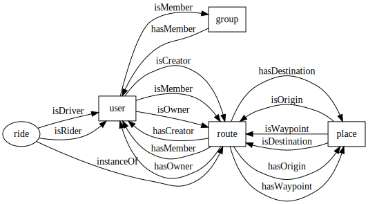
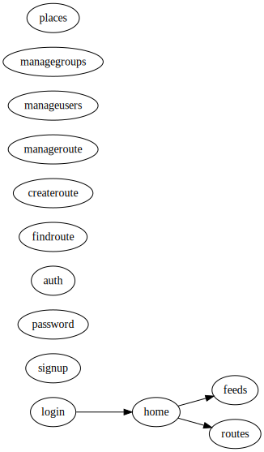
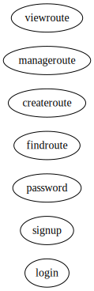

Concepts
========

* User - Driver or rider
* Group - Group of users sharing feeds
* Place - Physical Address
* Route - Origin, Destination, Way-points, Schedule
* Activity - Actions involving one of more of the above

Entity Properties
=================

* Place.addr1 : String
* Place.addr2 : String
* Place.city : String
* Place.state : String
* Place.zip : String
* Place.osmid : String // openstreetmapID

* User.active : boolean
* User.username : String
* User.url : String
* User.email : String
* User.tel : String
* User.picture : url
* User.workAddress : Place

* Group.name : String

* Route.active : boolean
* Route.origin : Place
* Route.waypoint : Place
* Route.destionation : Place

* Ride.driver : User
* Ride.rider : User
* Ride.plannedStartTime : DateTime
* Ride.actualDeparture : DateTime
* Ride.plannedEndTime : DateTime
* Ride.actualArrival : DateTime

Entity Diagram
==============

Activity Diagram
================

Web UX Diagram
================

Mobile UX Diagram
================

